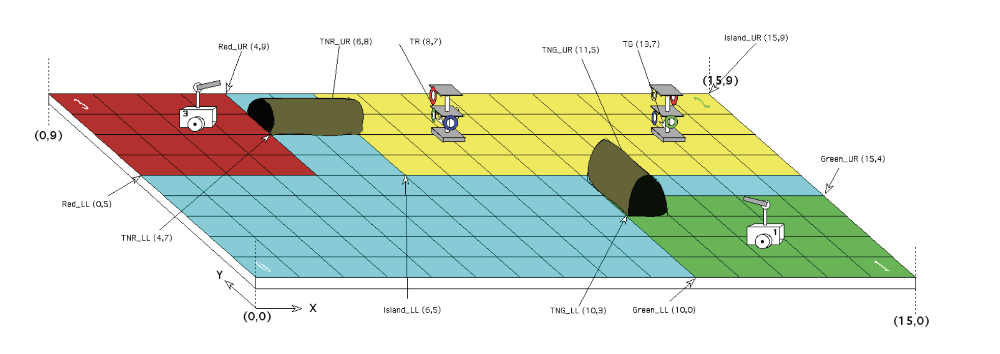
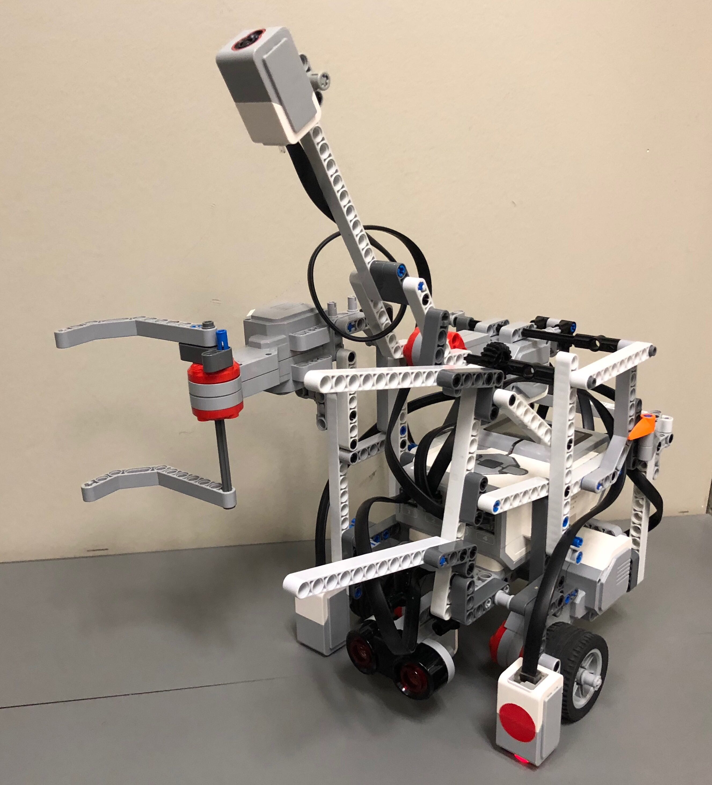
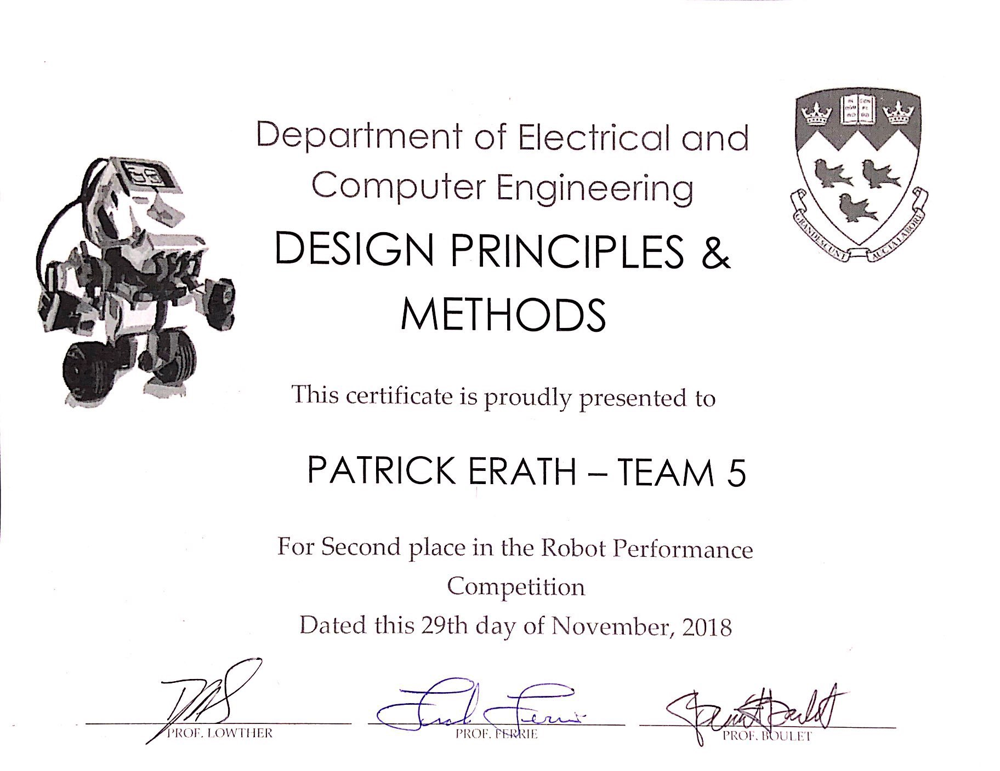

# ECSE211 - Design Principles and Methods

## The Final Project

The goal of this project was to design an autonomous robot that can navigate through a closed course. The robot must be able to traverse a tunnel and identify the correct colors of rings on a ringstand. The robot must then collect as many rings as possible and return to the starting position. The tunnel and ringstand is determined by which team the robot is on; Red or Green. All game parameters related to the competition are recieved via Wifi before each round.

### Our Poster

### Our Robot

### Certificate of completion

